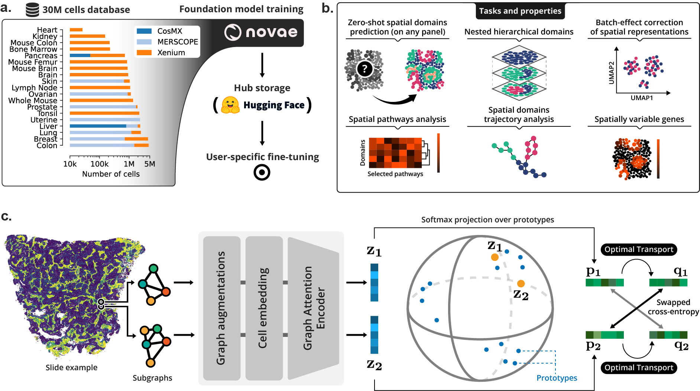

<p align="center">
  
</p>
<!-- TODO: when it becomes public: https://raw.githubusercontent.com/MICS-Lab/novae/main/docs/assets/banner.png -->

<div align="center">

[](https://pypi.org/project/novae)
[](https://pepy.tech/project/novae)
[](https://mics-lab.github.io/novae)

[](https://github.com/python/black)
[](https://github.com/MICS-Lab/novae/blob/main/LICENSE)
[](https://pycqa.github.io/isort/)
[](https://codecov.io/gh/MICS-Lab/novae)

</div>

<p align="center"><b><i>
  💫 Graph-based foundation model for spatial transcriptomics data
</b></i></p>

## Documentation

Check [Novae's documentation](https://mics-lab.github.io/novae/) to get started. It contains installation explanations, API details, and tutorials.

## Overview

<p align="center">
  
</p>

> **(a)** Novae was trained on a large dataset, and is shared on [Hugging Face Hub](https://huggingface.co/collections/MICS-Lab/novae-669cdf1754729d168a69f6bd). **(b)** Illustration of the main tasks and properties of Novae. **(c)** Illustration of the method behing Novae (self-supervision on graphs, adapted from [SwAV](https://arxiv.org/abs/2006.09882)).


## Installation

### PyPI

`novae` can be installed via `PyPI` on all OS, for `python>=3.9`.

```
pip install novae
```

### Editable mode

To install `novae` in editable mode (e.g., to contribute), clone the repository and choose among the options below.

```sh
pip install -e .                 # pip, minimal dependencies
pip install -e '.[dev]'          # pip, all extras
poetry install                   # poetry, minimal dependencies
poetry install --all-extras      # poetry, all extras
```

## Usage

Here is a minimal usage example. For more details, refer to the [documentation](https://mics-lab.github.io/novae/).

```python
import novae

model = novae.Novae.from_pretrained("MICS-Lab/novae-1-medium")

model.compute_representations(adata, zero_shot=True)
model.assign_domains(adata)
```

## Cite us

```txt
TODO: submit preprint (coming soon)
```
